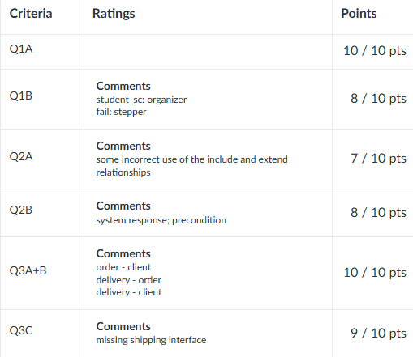

# CS3342 Assignment 1

My [solution](https://github.com/leoooliang/CityU-CS-Materials/blob/main/CS3342_Software_Design/Assignment_1/CS3342_ASM1_Solution.pdf) is provided for this assignment, also with the score: 



## Section 1 - Software Engineering (20 Marks)

### 1. Software Engineering Research Study - CILO1 (10 Marks)
Please carry out an independent study according to your book readings and online research, to address one of the two questions below by writing a short essay. (500 words approx. & provide your references)

- **a.** What are the main software quality attributes and how can we measure them? Please give an example of a software system that has high or low quality in terms of one or more attributes and explain why.

- **b.** What are the benefits and challenges of the agile software process model? Please compare the agile model with traditional models such as the waterfall model with an example.

### 2. Roles of Variables - CILO4 (10 Marks)
Study the following Java code and identify the role of each variable declared in the code listing by completing the tables below:

```java
public class Grades {
    public static void main(String[] args) {
        int student_id[] = {1031,1022,3021,2023,2062,3027,4022};
        int student_sc[] = {80,84,89,79,55,92,73};
        int fail = 0;
        int total = 0;
        int max_sc = 0;
        double average = 0;
        Boolean neg = false;
        final int student_num = student_id.length;
        for (int i = 0; i < student_num; i++) {
            int sc = student_sc[i];
            int id = student_id[i];
            total += sc;
            if (sc > max_sc) {
                max_sc = sc;
            }
            if (sc < 60) {
                fail++;
                neg = true;
            }
        }
        average = total / student_num;
        system.out.println();
        system.out.println("Number of student: " + student_num);
        system.out.println("Average score: " + average);
        system.out.println("Number of fail: " + fail);
        system.out.println("Maximum score: " + max_sc);
    }
}
```
Complete the table:

| Variable | Role | (10 Marks) |
|----------|------|------------|
| student_sc | | (1 Mark) |
| total | | (1 Mark) |
| average | | (1 Mark) |
| i | | (1 Mark) |
| student_num | | (1 Mark) |
| max_sc | | (1 Mark) |
| id | | (1 Mark) |
| neg | | (1 Mark) |
| fail | | (1 Mark) |
| sc | | (1 Mark) |

## Section 2 - Software Requirements Analysis - CILO2 (20 Marks)

**Case Study: Hotel Room Booking System**

When an Adult Customer wants to book a hotel room through the online booking system, the conduct room booking use-case/function usually includes two use-cases/functions: the customer will request the desired type of rooms and pay for those rooms.

For the request room use-case, the customer should specify the room type (for example, deluxe room, superior room, or standard room). What's more, IF the customer requests special requirements (for example, a kitchen, or a sea view), THEN the system should then book the room that meets the requirements.

After all the selections are completed (Note that the customer can choose multiple rooms), he/she may proceed to the CheckOut use-case, which will include (1) Calculate the total amount, and then (2) proceed to the Payment screen, where he/she will be given three options: (hint: use-case inheritance):

a. **PayByCreditCard**: the customer will enter the credit card information and pay by credit card, the payment will be processed by a CardPaymentSystem.

b. **PayByPayPal**: the customer will log in to PayPal and pay by PayPal, the payment will be validated by a PayPalValidationSystem.

c. **PayByWeChat**: the customer will scan a QR code and pay by WeChat, the payment will be validated by a WeChatValidationSystem.

In both two use-cases, IF any error occurs, THEN the system must be able to handle it via **HandleException**, there are three different error exceptions (hint: use-case inheritance):

d. **RoomUnavailable** (i.e., the room is unavailable for the selected date or time).

e. **TransactionAbort** (i.e., the customer chooses to cancel without completing the transaction).

f. **TimeOut** (i.e., the customer took too long to complete the transaction).

g. **OtherErrors** (i.e., this is to handle any other error not covered above).

Furthermore, if any other problems happen, the user should proceed to the **ReportBug** use-case, she/he can report the encountered errors/bugs via **CallPhone**, **SendEmail**, or **SendSystemMessage** method to track the problem. (hint: use-case inheritance)

IF the payment is successfully completed, THEN it will confirm the booking and send a confirmation email to the customer. The customer can now check in to the hotel with the confirmation number.

### A. Draw a Complete Use Case Diagram (10 Marks)
Based on the case study of the Hotel Room Booking System, draw a use case diagram for the Booking System. Whenever possible, your use case diagram MUST use `<<Extend>>` or `<<Include>>` to provide a good use case diagram.

### B. Requirements Specifications (10 Marks)
Based on the same case study described above, complete the following table to describe the Checkout use case under typical course of events, and alternative course of events. The situation involves the Customer actor, as well as external payment processing systems such as Card, PayPal, and WeChat validation systems.

| | | |
|----------------|----------|---|
| Use Case Name: | Checkout |  |
| Actor(s): | Customer, CardPaymentSystem, PayPalValidationSystem, WeChatValidationSystem |  |
| Description: | This use case describes the process of a customer completing the checkout for the room selected. On completion, the system will confirm the booking and send a confirmation email to the customer. |  |
| Reference ID: | HK-ROOM-BOOKING-1.0 |  |
| Typical course of events: | Actor Action | System Response |
| | Step 1: |  |
| |  | Step 2: |
| |  | Step 3: |
| | Step 4: |  |
| |  | Step 5: |
| |  | Step 6: |
| Alternative course of events: |  |  |
| Precondition: |  |  |
| Postcondition: |  |  |

## Section 3 - OO Modeling and Design Principles - CILO3 (20 Marks)

Study the following code fragments and answer the following questions. 

```java
class Client {
    private String name;
    private String tel;
    private Profile profile;
    
    public Client(String name, String tel) {
        this.name = name;
        this.tel = tel;
    }
    
    public void setProfile(String code, String address, String level) {
        profile = new Profile(code, address, level);
    }
    
    public Profile getProfile() {
        return profile;
    }
}

class Profile {
    private String code;
    private String address;
    private String level;
    
    public Profile(String code, String address, String level) {
        this.code = code;
        this.address = address;
        this.level = level;
    }
    
    public String toString() {
        return code + address + level;
    }
}

class Membership extends Client {
    private int points;
    
    public Membership(String name, String tel, int pointNum) {
        super(name, tel);
        points = pointNum;
    }
    
    public void setPoint(int newPointNum) {
        points = newPointNum;
    }
    
    public int getPoint() {
        return points;
    }
}

class VIP extends Client {
    private float discount;
    
    public VIP(String name, String tel, float discountNum) {
        super(name, tel);
        discount = discountNum;
    }
    
    public void setDiscount(float newDiscountNum) {
        discount = newDiscountNum;
    }
    
    public float getDiscount() {
        return discount;
    }
}
```

### A. Draw Class Diagram (5 Marks)
Based on your observation of the provided code fragments, draw a complete class diagram to illustrate the class interactions and inheritance (hint: Class diagram captured from BlueJ will NOT be accepted, please use Visual Paradigm).

### B. Extend Class Design (5 Marks)
Assuming that there is a new year promotion event organized for both Membership and VIP, and there are many orders belonging to clients. Extend the existing class diagram design to correctly show classes `Order` and `Delivery`. Class `Order` should contain important attributes of order number, client Name, and goods. Class `Delivery` should record which way of Shipping is adopted for the Order. So, it should contain an attribute of the delivery's Shipping in the delivery. (hint: you may classify the shipping as String in (B).)

### C. Design Refinement (10 Marks)
The delivery's Shipping is classified as String in (B), however, if we want to classify different Shipping with details, and more importantly each Shipping method will need to be able to perform different operations (e.g., Standard and Premium shipping method, and the `getDeliveryDate` operation may behave differently on different shipping methods), how would you modify the current design to allow multiple Roles using correct Object-Oriented Design? Please provide a short description of your design and justify your design choice.

